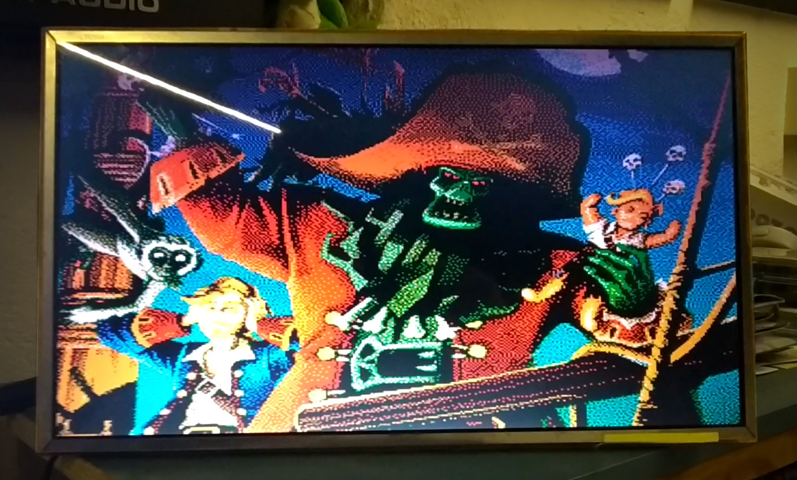
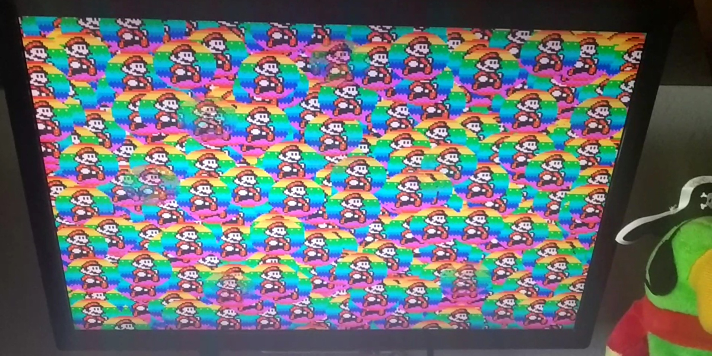
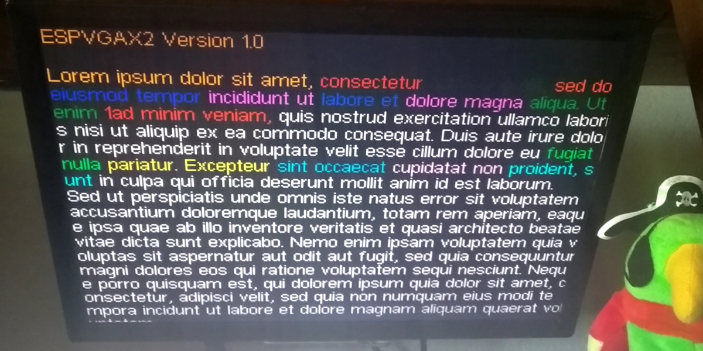
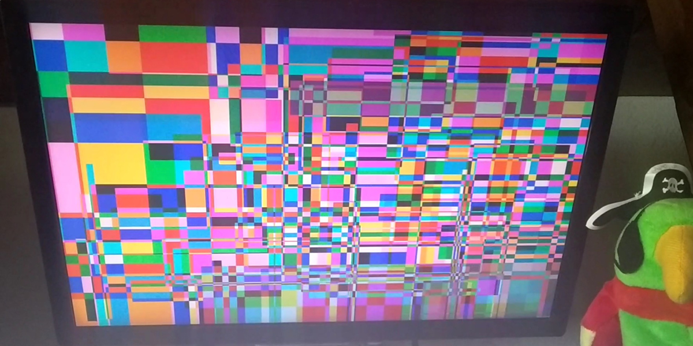
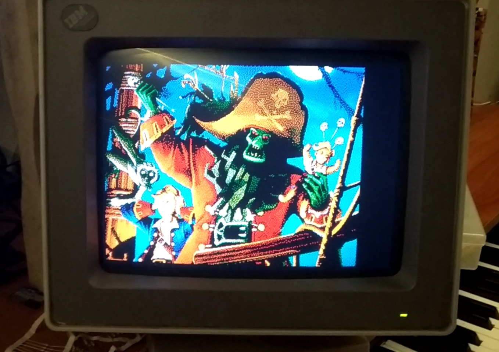
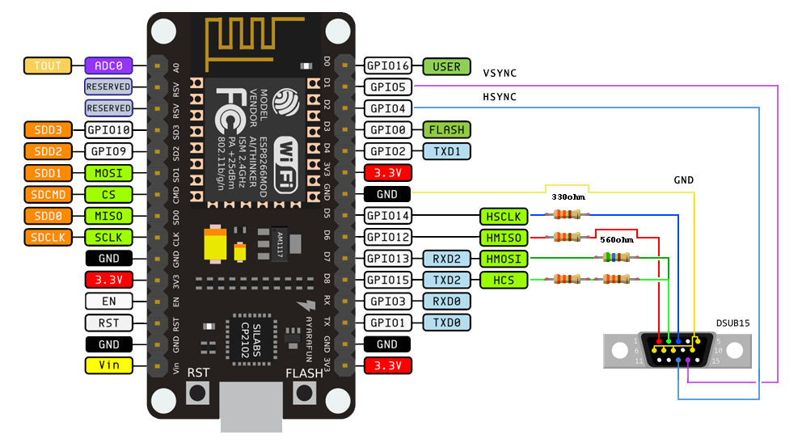
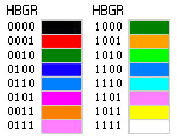
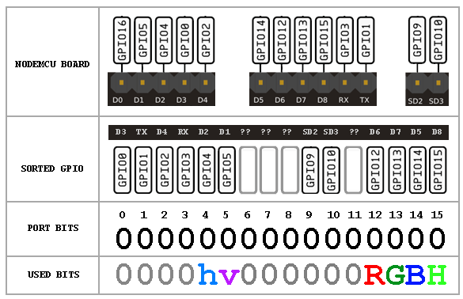
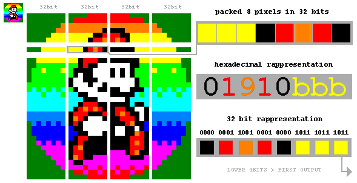

# ESPVGAX2 Library for ESP8266

COPYRIGHT (C) 2020 Sandro Maffiodo  
[smaffer@gmail.com](mailto:smaffer@gmail.com)  
[http://www.sandromaffiodo.com](http://www.sandromaffiodo.com)

YouTube videos:

Some photos:

 

## What is ESPVGAX2?

This is an evolution of [ESPVGAX](https://github.com/smaffer/espvgax) VGA library for ESP8266.  
To use this library you need only 5 resistor and one DSUB15 connector.  
This library require an ESP8266 with all GPIO exposed, like ESP-12E, NodeMCU-12E board or any board that expose GPIO5 (D1), GPIO4 (D2) and GPIO13 (D7)

## Credits

VGA signal generation based on [https://github.com/hchunhui/esp-vga](https://github.com/hchunhui/esp-vga) (thanks for your awesome works).

## Video

The library implement a 320x240px or 256x240px framebuffer with 16 colors, where each pixel is stored as as 4 bits. 

The framebuffer is stored inside RAM and require 38400 bytes. The VGA signal generation is stable only if you do not use any other hardware feature of the MCU (like Wifi or HW Serial). If you want, in theory, you can use another board to drive the one that use ESPVGAX2 library, by writing a comunication layer based on SoftwareSerial or I2C.

The pixel output is done in pure C++, software bitbanging.

## Wiring

For the basic usage you need:

- 4x 330ohm resistor 
- 1x 560ohm resistor 
- 1x DSUB15 female connector

Then connect them like the following schema.  

*NOTE: The DSUB15 connector is shown from rear view*
*NOTE: The resistor values are not 100% correct, these are the resistor values that i had available when i have created the library*

### Colors palette

The 16 colors generated from ESPVGAX2 library are not fixed. The sourcecode of the library will push out the 4bit colors on D5 D5 D7 D8 pins but there are zero assumption about the purpose of these bits (if the bit is red, green, blue, or high-green). Keep in mind that you change the pin wiring all the Examples will generate "wrong" colors.

These are all of the possible combinations, done with my wiring:

### GPIO port mapping

This is one of the tricky parts of this library creation process. 

The GPO GPIO port on ESP8266 is a 32bit word that allow to write 16 pin with a single operation (not a single instruction, because more than 2 instructions are needed) but the layout of GPO bits match GPIO order and *not* Arduino digital pin order.
You can se in the following schema that, for example, Arduino pin D3 is in reality GPIO0 and is stored in GPO as the lower bit 0 and Arduino TX pin is the bit 1 and so on.

From my tests i was not able to find a nearly packed 4bits other than Arduino D5 D6 D7 D8, that i can write with a minimum number of instructions. These Arduino bits are, in reality, GPIO12 GPIO13 GPIO14 GPIO15 and the fun fact is that are not mapped as expected:

	D5 = GPIO14
	D6 = GPIO12
	D7 = GPIO13
	D8 = GPIO15

In the schema you can se that "h" and "v" pins, used for VGA horizzontal and vertical SYNC, are wired to bit 4 of GPO (Arduino D2) and bit 5 of GPO (Arduino D1). The RGBH bits are wired/mapped in GPO at bits 12,13,14,15. 

*NOTE: the code the push out pixels does not assume that bit 12 is red, bit 13 is green, bit 14 is blue and bit 15 is high-green. You can change the wiring of resistors and the final purspose of each bit but keep in mind that these 4 packed bits cannot be easily changed. For example you can swap the order of wiring to HBRG without any change to the source code*

## 32bit and 8bit Framebuffer

The internal framebuffer is stored as a 32bit framebuffer, where each 32bit word hold 8 packed pixels. You can write to the framebuffer 32 pixels at a time (putpixel32 method), in this case the write operation will be faster than writing single pixels.
The same framebuffer can be written 8 pixels at a time, by using a different memory pointer (ESPVGAX2::fbb instead of ESPVGAX2::fbw) and a dedicated set of methods (putpixel8, xorpixel8, etc ..).

The following schema describe the process of blit of one 32bit word from a sprite image:

The implementation of software bitbanging to push out pixels is done in C++ using some Macro:

	register volatile uint32_t *out = (volatile uint32_t *)0x60000300; //GPO
    register uint32_t *in = (uint32_t*)line;
    register uint32_t gpo0 = GPO & 0xffff0fff;
    register uint32_t c;
	//...
    #define PUT8PIXELS \
      c = *in++; \
      *out = ((c << 12U) & 0x0000f000U) | gpo0; \
      *out = ((c <<  8U) & 0x0000f000U) | gpo0; \
      *out = ((c <<  4U) & 0x0000f000U) | gpo0; \
      *out = ((c <<  0U) & 0x0000f000U) | gpo0; \
      *out = ((c >>  4U) & 0x0000f000U) | gpo0; \
      *out = ((c >>  8U) & 0x0000f000U) | gpo0; \
      *out = ((c >> 12U) & 0x0000f000U) | gpo0; \
      *out = ((c >> 16U) & 0x0000f000U) | gpo0; 
    PUT8PIXELS;
    PUT8PIXELS;
   
As you can see the framebuffer pixels are read as 32bit word (packed 8 pixels):

	register uint32_t *in = (uint32_t*)line;
	//...
	register uint32_t c;
	//...
	c = *in++;

The "c" 32bit word is shifted out on GPO port using 8 fixed shift operations. Each output is masked with 0000F000 to keep set **only** the bits 12,13,14,15. After that this 4 bits are merged with the current GPO port bits with a bitwise OR. This is needed to keep any other GPIO bit value unchanged, without forcing any other bit to 0 or 1, other than bits 12,13,14,15.

*NOTE: PUT8PIXELS Macro is used to manually unroll the loop that push out all the 320 (or 256) pixels. A C++ loop may works only if the compiler will unroll the loop implicitly but for huge loop this is not guaranteed*

## Interrupt and Timers

ESPVGAX2 library will use only one timer: TIMER1. The interrupt function take some times and from my tests has some glitch when the other ESP8266 background tasks are used. For example, when you need to use Wifi, is required to stop the VGA signal generation and restart after the Wifi comunication is completed.

## 80Mhz or 160Mhz

This library support both 80Mhz and 160Mhz MCU running speed. The 320x240px resolution is enabled only with 160Mhz due to the speed required to push out 320 horizzontal pixels in pure software bitbanging. Running at 80Mhz, with the current implementation, i was not able to push out more than 256px without generating an unstable video signal; for example i was able to push 280px running at 80Mhz but the signal works only on one Monitor and NOT on my other Monitors.

From my tests i have found that the slowest part of pushing out pixels is related to the "memw" instruction used to perform the "real" port write operation. This is the compiled assembly code from PUT8PIXELS macro:

	3568 		l32i.n	a6, a5, 12
	118640 		slli	a8, a6, 12
	f48080 		extui	a8, a8, 0, 16
	208830 		or	a8, a8, a3
	0020c0 		memw
	0289 		s32i.n	a8, a2, 0
	118680 		slli	a8, a6, 8
	108840 		and	a8, a8, a4
	208830 		or	a8, a8, a3
	0020c0 		memw
	0289 		s32i.n	a8, a2, 0
	1186c0 		slli	a8, a6, 4
	108840 		and	a8, a8, a4
	208830 		or	a8, a8, a3
	0020c0 		memw
	0289 		s32i.n	a8, a2, 0
	108640 		and	a8, a6, a4
	208830 		or	a8, a8, a3
	0020c0 		memw
	0289 		s32i.n	a8, a2, 0
	418460 		srli	a8, a6, 4
	108840 		and	a8, a8, a4
	208830 		or	a8, a8, a3
	0020c0 		memw
	0289 		s32i.n	a8, a2, 0
	418860 		srli	a8, a6, 8
	108840 		and	a8, a8, a4
	208830 		or	a8, a8, a3
	0020c0 		memw
	0289 		s32i.n	a8, a2, 0
	418c60 		srli	a8, a6, 12
	108840 		and	a8, a8, a4
	f56060 		extui	a6, a6, 16, 16
	208830 		or	a8, a8, a3
	106640 		and	a6, a6, a4
	0020c0 		memw
	0289 		s32i.n	a8, a2, 0
	206630 		or	a6, a6, a3
	0020c0 		memw
	0269 		s32i.n	a6, a2, 0

The "memw" instruction is responsible to write the GPO data but seems to take its own time indipendently from the interval of time (number of instructions) lost between each "memw" calls. 

Another strange behavior that i've found is that when some other user code, outside interrupt function, works on PROGMEM data, reading readonly pages from FLASH storage, some delays in "memw" are introduced and the generated signal become unstable. This appear to happen more frequently when the number of read from PROGMEM (via pgm_read_byte or pgm_read_dword) are huge (for example when blitting fonts and reading fontmap data from PROGMEM).

*NOTE: I've tryed to write the pixel out code in pure assembly but i was not able to implement a working substitutional code for PUT8PIXELS macro. An assembly version, using XTENSA instructions will be more precise and will generate a more uniform pixels widths.*

## Limitations

When this library is running (begin/end methods) some Arduino functions cannot be used. For example, if you return from the loop function, Arduino firmware will call yield function. This function can generate some noises to the VGA signal. This event also happen if you call the Arduino delay function. More noises will be generated if you try to use Wifi and ESPVGAX2 both at the same time... To prevent noises you need to temporarely turn off ESPVGAX2 and restart that after Wifi comunications (see /examples/Wifi for example).
Instead of using these Arduino functions you can use the ESPVGAX2 versions: delay(), rand(), srand().

## Library usage

To use the ESPVGAX2 library you need to include its header

    #include <ESPVGAX2.h>

ESPVGAX2 class is static, so you can use the class without create an instance of it:

    void setup() {
      ESPVGAX2::begin();
    }”

Or, if you prefer, you can create your instance, but keep in mind that cannot be
more than one ESPVGAX2 instance at a time:

    ESPVGAX2 vga;

    void setup() {
      vga.begin();
    }

## Examples

This is a simple example of putpixel8 function. The putpixel8 function put 8
pixels at a time. The following code create a pattern of colors in the setup
function:

	#include <ESPVGAX2.h>

    ESPVGAX2 vga;

    void setup() {
      vga.begin();
      vga.clear(0xAA);
      for (int y=0; y!=ESPVGAX2_HEIGHT; y++) {
        for (int x=0; x!=ESPVGAX2_WIDTH; x++) {
          vga.putpixel(x, y, vga.rand()%16);
        }
      }
    }
    void loop() {
      while (1) {
        //never return from loop(). never call delay() or yield() functions
      }
    }

For the others examples, you can load and build one of the examples released with ESPVGAX2:

- **RandomPixel** generate random pixels using putpixel, putpixel8 and putpixel32
- **Draw** draw circles, rectangles and lines
- **Image** draw an image
- **BitFont** print a string using a variable width font
- **BitmapFont** print a string using a monospaced font
- **BitmapFontPlotter** print a string one character at a time, like a plotter or a terminal
- **BitmapFontRandom** print random characters using a monospaced font
- **3D** draw some cubes in 3D, porting of a famous Adafruit example program
- **Wifi** start a webserver and wait external messages. each text message sent over Wifi will be displayed for 10 seconds
- **Demo** a DEMO sequence of some of other tests
   
## Fonts

These fonts are released with ESPVGAX2, inside the /fonts2/ folder:

- **Arial 12**  
- **Century Gothic 11**  
- **Courier 10**  
- **Lucida 11**   
- **Lucida 10**  
- **Millifont 6 (created by me)**  
- **Microfont 6 (created by me)**  
- **Monaco 9**  
- **Monospaced DOS 12**  
- **Monospaced DOS 8**  
- **MS Sans 10**  
- **Ocra 9**  
- **PT Monospaced 9**  
- **Tahoma 11**  
- **Times New Roman 11**  

## Tools

### 4bitimage

To convert an image to the ESPVGAX2 format (4bit per pixel) i wrote a simple webapp that reads an image and create a C/C++ source file to be used with ESPVGAX2.

The image that you can use as a source must use only 16 colors, with dithering. You can use any image processor to convert your images to the right palette. [here you can download](docs/16colors.act) a Photoshop palette file with my 16 colors. 

Keep in mind that you can wire your board differently, obtaining a different sets of 16 colors. In this case you need to create your own palette file and convert your images with that.
Note that if you change your color wiring, you probably need to modify the 4bitimage.html source code where the colors bit are joined toghether:

	for (var x=0; x<cdata.width; x++) {
        var idx=(x+y*cdata.width) * 4;
        var r = data[idx + 0];
        var g = data[idx + 1];
        var b = data[idx + 2];
        var h = 0;
        r = r>126 ? 1 : 0; //## threshold, change to yours need
        b = b>126 ? 1 : 0; //## threshold, change to yours need
        if (g>192) { //## threshold, change to yours need
            h=1;
            g=1;
        } else if (g>126) { //## threshold, change to yours need
            h=1;
            g=0;
        } else if (g>64) { //## threshold, change to yours need
            g=1;
        } else {
            g=0;
        }
        //## bit packing, change accordling to yours MCU wiring
        var pixel = (h<<3) | (b<<2) | (g<<1) | (r);
        outpixel|=pixel<<(pshift*4);
        pshift++;
        if (pshift>7) {
            append();
        }
    }

The source file of the webapp is inside the tools directory. You can open 1bitimage.html with your webbrowser and run it locally. I use Google Chrome, dunno if works with other webbrowsers.

### 1bitfont

With 1bitfont you can create your fonts from a single image and convert them to be used with ESPVGAX2 library. The tool reads an image that contains all font's glyphs are separated from one or more vertical blank lines. All glyphs are extracted and converted to a C/C++ source file.

1bitfont is a webapp, like 1bitimage, that can run locally on your webbrowser.
    
## FAQ

- How to center the video signal horizontally? If you want, you can modify the code of the library, where the HSYNC signal is generated. Seach NOP_DELAY inside ESPVGAX2.cpp. Wrong values can destroy the VGA signal
- How can i prevent screen flickering? At this time there is no one mechanism to prevent the flickering. From my tests, when flicker appear, there is a delay in the interrupt call or in the pixeldata output timing. Some flickers will appear if you try to read more than 32K from FLASH (for example in the /examples/Image example you can se a little flicker), the cause can be a cache miss inside the memory mapping of ESP8266??
- How can i change PINS? In theory is possible to change HSYNC and VSYNC PINS by changing the library header ESPVGAX2.h. D5 D6 D7 and D8 PINS can be changed but you need to modify also the PUT8PIXELS macro to shift out your 4bit data to the right output 4 digital pin 
- Why ESPVGAX2 has all its internal symbols defined with a "2" suffix (for example ./fonts2/ and fnt2_arial_* fontmap)? This is because in theory, in future versions, the memory allocation of the framebuffer can be modified to be dynamic (instead of static). This change can, in the future, allow the user sketch to use ESPVGAX (version1) and ESPVGAX2 one at a time, calling begin/end() methods of one library and after that toggling to another library with another begin/end() call.

## Happy hacking

If you find a way to optimize the speed of the library, or find a way to remove unstable signal when using Wifi let me know!

Happy hacking!
